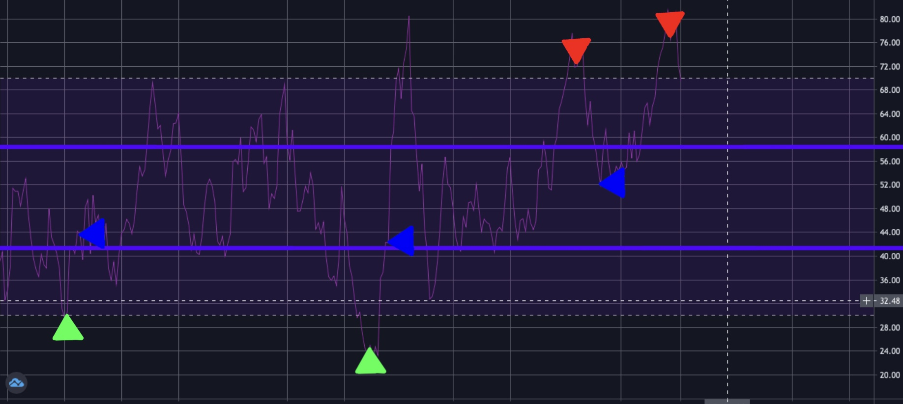
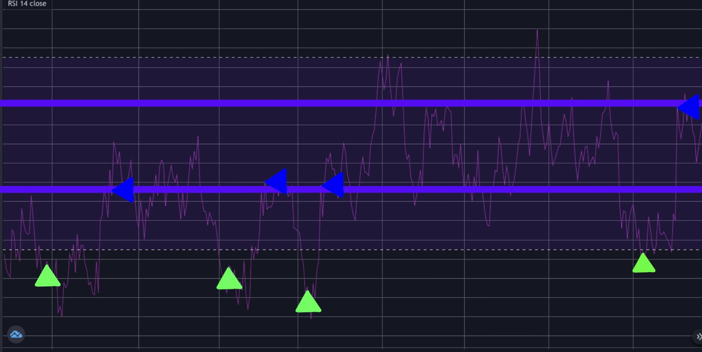
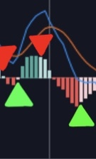

# trading_sys:

The main file of quick_trade.

## Trader

A class in which you can trade and test strategies.

| param | type | description |
|:---:|:---:|:---:|
|ticker|str|symbol for CCXT (with "/")|
|df|pd.DataFrame|dataframe with columns: Close, Open, High, Low, Volume|
|interval|str| timeframe:1m 2m 3m 5m 15m 30m 45m 1h 90m 2h 3h 4h 12h 1d 3d 1w 1M 3M 6M|

### _get_attr

getattr from self

| param | type | description |
|:---:|:---:|:---:|
|attr|str|name of attribute|
|returns|attribute|attribute|

### _get_this_instance

| param | type | description |
|:---:|:---:|:---:|
|*args|arguments|argument for trading class \_\_init__|
|*kwargs|named arguments|named argument for trading class \_\_init__|
|returns|Trader (or child class)|new trading object|

### __get_stop_take

The method converts stop loss and take profit in points to stop loss and take profit in specific prices using self._
stop_loss and self._take_profit as values and self._open_price as the initial price

| param | type | description |
|:---:|:---:|:---:|
|sig|PREDICT_TYPE|signal buy/sell/exit|
|returns|Dict|{'stop': S/L value, 'take': T/P value}|

### sl_tp_adder

A method for adding a number of points to the current S/L and T/P values.

| param  | type | description |
| :---: | :---: | :---: |
| add_stop_loss | float | points for addition to sl |
| add_take_profit | float | points for addition to tp |
| returns | Tuple\[stop_losses, take_profits] | sl, tp |

### strategy_diff

The strategy issues its verdict based on the last change to the dataframe. If you give the entry the closing price of
candles, then if the candle is green - long, if red - short

| param  | type | description |
| :---: | :---: | :---: |
| frame_to_diff | pd.Series | series of dataframe |
| returns | PREDICT_TYPE_LIST | returns |

### strategy_rsi

When the RSI is greater than the ```maximum```, and the current value is less than the previous one, short. It's the
same with long (but with ```minimum```).

If the value has crossed the border with ```mid``` - exit

| param  | type | description |
| :---: | :---: | :---: |
| minimum | float | min level of RSI |
| maximum | float | max level of RSI |
| max_mid | float | max/mid level of RSI (exit from short) |
| min_mid | float | min/mid level of RSI (exit from long) |
| returns | PREDICT_TYPE_LIST | returns |

example:



### strategy_parabolic_SAR

parabolic SAR strategy

| param  | type | description |
| :---: | :---: | :---: |
| plot | bool | plotting of SAR indicator |
| **sar_kwargs | named arguments | named arguments for ```ta.trend.PSARIndicator``` |
| returns | PREDICT_TYPE_LIST | returns |

### strategy_macd_histogram_diff

```strategy_diff``` with MACD's histogram data.

| param  | type | description |
| :---: | :---: | :---: |
| slow | int | slow MA of MACD |
| fast | int | fast MA of MACD |
| **macd_kwargs | named arguments | named arguments for ```ta.trend.MACD``` |
| returns | PREDICT_TYPE_LIST | returns |

example:



### strategy_supertrend

supertrend strategy. S/L - ST indicator

| param  | type | description |
| :---: | :---: | :---: |
| plot | bool | plotting of SAR indicator |
| **st_args | arguments | arguments for ```SuperTrendIndicator``` |
| **st_kwargs | named arguments | named arguments for ```SuperTrendIndicator``` |
| returns | PREDICT_TYPE_LIST | returns |

### strategy_bollinger

Bollinger bands strategy (not breakout)

| param  | type | description |
| :---: | :---: | :---: |
| plot | bool | plotting of bollinger bands |
| to_mid | bool | exit on mid line of ```ta.volatility.BollingerBands``` |
| **bollinger_args | arguments | arguments for ```ta.volatility.BollingerBands``` |
| **bollinger_kwargs | named arguments | named arguments for ```ta.volatility.BollingerBands``` |
| returns | PREDICT_TYPE_LIST | returns |

### get_heikin_ashi

Heikin Ashi candles

| param  | type | description |
| :---: | :---: | :---: |
| df | pd.DataFrame | dataframe with Open, High, Low, Close data |
| returns | pd.DataFrame | HA ohlc |

### crossover

| param  | type | description |
| :---: | :---: | :---: |
| fast | Iterable | When the element of this parameter is less than the element of the ```slow``` parameter - short. When more - long. |
| slow | Iterable | When the element of this parameter is greater than the element of the ```fast``` parameter - short. When less, it takes a long time. |
| returns | PREDICT_TYPE_LIST | crossover  strategy |

### inverse_strategy

| param  | type | description |
| :---: | :---: | :---: |
| fast | Iterable | When the element of this parameter is less than the element of the ```slow``` parameter - short. When more - long. |
| slow | Iterable | When the element of this parameter is greater than the element of the ```fast``` parameter - short. When less, it takes a long time. |
| returns | PREDICT_TYPE_LIST | crossover  strategy |

### backtest

A method with the functionality of testing a strategy on historical data. For it to work, you need to use a strategy
that will assign values to `self.returns`,` self._stop_losses`, `self._take_profits` and `self._credit_leverages`.

| param  | type | description |
| :---: | :---: | :---: |
| deposit | float | Initial deposit for testing the strategy that you used before the test |
| bet | float | The amount of money in one deal. If you want to enter the deal on the entire deposit, enter the value ```np.inf``` |
| commission | float | Commission for opening a deal in percentage. If you need to exit the previous one to enter a trade, the commission is deducted 2 times. |
| plot | bool | Plotting data about candles, deposits and trades on the chart. |
| print_out | bool | Displaying data on the number of profitable and unprofitable trades and annual income to the console. |
| column | str |  |
| show | bool |  |
| returns | pd.DataFrame |  |

?> The commission does not reduce the trade itself, but decreases the deposit, but if the deposit becomes less than the desired trade, deal is immediately reduced to the level of the deposit.
